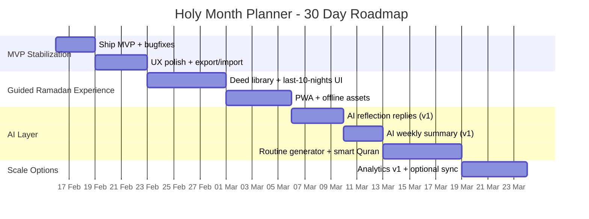

# বাংলা “Holy Month Planner” ওয়েব অ্যাপ রিসার্চ রিপোর্ট

## এক্সিকিউটিভ সামারি

এই রিপোর্টে বাংলা ও গ্লোবাল—মোট তেইশটির বেশি রমজান প্ল্যানার/অ্যাপ/টেমপ্লেট (মোবাইল অ্যাপ, ওয়েব অ্যাপ, PDF, Notion টেমপ্লেট, Gumroad/Etsy প্রোডাক্ট, ফিজিক্যাল প্ল্যানার) বিশ্লেষণ করে একটি **ফিচার-প্রায়োরিটাইজড, বাস্তবসম্মত** পরিকল্পনা দেওয়া হয়েছে—বিশেষ করে **২৪ ঘণ্টার React + Vite + localStorage MVP** এবং রমজান চলাকালীন **৩০ দিনের AI-এনহ্যান্সড রোডম্যাপ**। citeturn16view0turn16view1turn18view2turn17view5turn1search5turn19search5turn10view1turn15view0turn11view0turn13view0turn25search8turn2search22turn0search10turn25search11turn27search10turn28search25turn21view4turn22view0turn19search3

সবচেয়ে ধারাবাহিকভাবে দেখা প্যাটার্নগুলো হলো: **ডেইলি চেকলিস্ট/ট্র্যাকার**, **কুরআন ট্র্যাকিং**, **দু’আ/যিকির কন্টেন্ট**, **রিফ্লেকশন জার্নাল**, এবং কিছু প্রোডাক্টে **“Deed of the day/Tip of the day”** ধরনের মাইক্রো-গাইডেন্স। citeturn10view1turn15view0turn13view0turn25search8turn21view4

বাংলা ব্যবহারকারীদের জন্য বড় সুযোগ (gap/opportunity):  
- অনেক গ্লোবাল অ্যাপ ফিচার-হেভি এবং বিজ্ঞাপন/সাবস্ক্রিপশন-কেন্দ্রিক; “রমজান-ফোকাসড প্ল্যানিং” সেকশন থাকলেও বাংলা কপি, সাংস্কৃতিক টোন, এবং সহজ ট্র্যাকিং অভিজ্ঞতা অনেক সময় লক্ষ্যভিত্তিক নয়। citeturn17view5turn18view2turn1search5  
- বাংলা কন্টেন্ট-কেন্দ্রিক প্ল্যানার/অ্যাপে (আয়াত/হাদিস/দু’আ) “স্ট্রাকচার্ড ট্র্যাকিং + রিফ্লেকশন + কুরআন ক্যালকুলেটেড প্ল্যান” কম দেখা যায়, বা UX/ডেটা ব্যাকআপ/ব্যক্তিগত গোপনীয়তা-ফার্স্ট ডিজাইন স্পষ্ট নয়। citeturn16view0turn16view1

**সুপারিশকৃত MVP (২৪ ঘণ্টা)**: “এক স্ক্রিনে আজকের আমল” ধারণা—(১) সালাত/রোজা/তারাবিহ/তাহাজ্জুদ টগল, (২) কুরআন প্ল্যান + আজ কত পৃষ্ঠা, (৩) যিকির কাউন্টার (কাস্টম), (৪) ৩–৫ লাইনের রিফ্লেকশন নোট, (৫) অটো “কালকের জন্য ছোট টার্গেট”। এই সেট ফিচারগুলো অধিকাংশ সফল প্ল্যানারের “কোর” অংশ—কিন্তু বাংলা-ফার্স্ট ও অফলাইন-ফার্স্ট করে সহজে শিপ করা যায়। citeturn10view1turn15view0turn21view4turn25search8turn19search5

---

## গবেষণা পদ্ধতি ও মানদণ্ড

এই স্টাডিতে **মার্কেটপ্লেস/অফিশিয়াল স্টোর/অফিশিয়াল PDF** প্রাধান্য দেওয়া হয়েছে:  
- Android অ্যাপ: entity["company","Google Play","android app store"] লিস্টিং/ডিসক্রিপশন/ডেটা সেফটি/মনিটাইজেশন ট্যাগ (ads, in‑app purchases) citeturn18view2turn17view5turn18view0turn30view0turn16view1  
- PDF প্ল্যানার: সংগঠন/প্রকাশকের অফিসিয়াল PDF (উদাহরণ: entity["organization","Islamic Relief USA","charity organization, us"], entity["organization","Islamic Relief Australia","charity organization, australia"]) citeturn10view0turn15view0turn10view1turn10view4  
- Notion টেমপ্লেট: entity["company","Notion","productivity software company"] Marketplace টেমপ্লেট পেজ/স্নিপেট citeturn31view2turn32view1turn31view1turn32view0  
- ডিজিটাল প্রোডাক্ট: entity["company","Gumroad","digital goods marketplace"] এবং entity["company","Etsy","handmade marketplace"] লিস্টিং টেক্সট/প্রাইস/ফিচার-লিস্ট citeturn28search25turn27search10turn21view4turn22view0turn27search7  
- “ফিচার এক্সট্রাকশন” করা হয়েছে **লিস্টিং/ডেসক্রিপশন/প্রিভিউ/স্ক্রিনশট/অফিশিয়াল ডক** থেকে; পেইড/JS-ব্লকড পেজে অতিরিক্ত ভিতরের কনটেন্ট যাচাই সম্ভব না হলে টেবিলে **“উল্লেখ নেই/অজানা”** ধরা হয়েছে। citeturn21view4turn28search25turn27search10

---

## সংগ্রহকৃত প্ল্যানার ও অ্যাপ ইনভেন্টরি

নিচের টেবিলে নাম, প্ল্যাটফর্ম, ভাষা, মূল্য/মনিটাইজেশন, টার্গেট অডিয়েন্স এবং সোর্স (ক্লিকযোগ্য রেফারেন্স) দেওয়া হলো।

| পণ্য | ভাষা | প্ল্যাটফর্ম | মূল্য/মনিটাইজেশন | টার্গেট অডিয়েন্স (ইঙ্গিত/উল্লেখিত) | সোর্স |
|---|---|---|---|---|---|
| entity["organization","Ramadan Planner","bangla ramadan planner app"] | বাংলা | Android অ্যাপ | Play listing-এ মূল্য আলাদা করে উল্লেখ নেই (Install) | বাংলা ব্যবহারকারী; আয়াত/হাদিস/দু’আ + চেকলিস্ট ভিত্তিক যারা চান | citeturn16view0turn18view3 |
| entity["organization","রামাদান প্ল্যানার (GearUp Lab)","bangla ramadan planner app"] | বাংলা | Android অ্যাপ | “বিনামূল্যে” ও “বিজ্ঞাপন মুক্ত” বলে উল্লেখ | পরিবার/বাংলাভাষী; দৈনিক রুটিন/দু’আ/রিমাইন্ডার-ধাঁচ | citeturn17view2turn17view3 |
| entity["organization","Muslim & Ramadan Planner","ramadan planner app"] | বাংলা (লিস্টিং) | Android অ্যাপ | উল্লেখ নেই | যারা বাধ্যতামূলক+সুপারিশকৃত আমলের সময়সূচি সাজাতে চান | citeturn16view2 |
| entity["organization","Athan: Ramadan 2026 & Al Quran","islamic prayer times app"] | বহু ভাষা | Android অ্যাপ | Ads + in‑app purchases; সাবস্ক্রিপশন উল্লেখ | প্রেয়ার টাইম/রমজান ক্যালেন্ডার/দু’আ/লগিং | citeturn18view2turn17view4 |
| entity["company","Muslim Pro","islamic lifestyle app"] | বহু ভাষা | Android অ্যাপ (এবং iOS) | “Contains ads” + “In‑app purchases”; প্রিমিয়াম/অফলাইন/অ্যাড‑ফ্রি উল্লেখ | অল‑ইন‑ওয়ান ইসলামিক ইউজার; কুরআন+দু’আ+যিকির+রিমাইন্ডার | citeturn17view5turn16view5turn1search0turn1search17 |
| entity["company","Pillars","prayer times app"] | ইংরেজি/বহু ভাষা | Android অ্যাপ (এবং iOS) | অ্যাড‑ফ্রি/প্রাইভেসি‑ফোকাসড (No Ads দাবি), ফ্রি | যারা ক্লিন UI, গোপনীয়তা, প্রেয়ার+ফাস্টিং ট্র্যাক চান | citeturn16view4turn1search5turn1search8 |
| entity["organization","Ramadan Legacy","ramadan planner app"] | ইংরেজি | Android অ্যাপ (এবং iOS রেফারেন্সড) | “License Free” (ডাউনলোড); কিছু সোর্সে Ads উল্লেখ | ৩০‑দিনের ইন্টারঅ্যাকটিভ প্ল্যান, জার্নাল, সোশ্যাল শেয়ার | citeturn19search5turn19search0turn19search7turn19search4 |
| entity["organization","Ramadan 2024","ramadan app"] | ইংরেজি | Android অ্যাপ | “Contains ads” | লার্নিং‑ফোকাসড; তাসবিহ কাউন্টার+হাদিস ডাউনলোড/শেয়ার | citeturn30view0 |
| entity["organization","Ramadan Planner App","ramadan planner web app"] | ইংরেজি | ওয়েব অ্যাপ (privacy policy) | উল্লেখ নেই | যারা লগইন+লোকেশন বেসড প্রেয়ার টাইম, হিস্টোরি দেখতে চান | citeturn3view0 |
| entity["organization","1447H 2026 Ramadan Journal","ramadan journal pdf"] | ইংরেজি | PDF | ফ্রি ডাউনলোড কন্টেন্ট | প্রিন্ট‑ফিল ডেইলি প্ল্যানার; প্রেয়ার/কুরআন/তারাবিহ/কিয়াম+রিফ্লেকশন | citeturn10view0turn10view1turn10view2 |
| entity["organization","Ramadan Action Plan","ramadan planner pdf"] | ইংরেজি | PDF | ফ্রি ডাউনলোড কন্টেন্ট | সব বয়স; ডেইলি ট্র্যাকার + “tip/deed of day” + দু’আ | citeturn10view3turn15view0turn10view4 |
| entity["organization","Productive Ramadan Daily Planner","ramadan daily planner pdf"] | ইংরেজি | PDF | ফ্রি | সালাত টাইমকে কেন্দ্র করে ডেইলি প্ল্যানিং—“বারাকা‑ফোকাস” | citeturn11view0turn2search17 |
| entity["organization","Ramadan Planner (Al Huda Institute)","ramadan planner pdf sri lanka"] | ইংরেজি | PDF | ফ্রি (প্রকাশিত PDF) | প্রি‑রমজান প্রেপ + ডেইলি সালাত/কিয়াম/সদকা/খাবার/কুরআন গোল | citeturn10view5turn10view6turn13view0 |
| entity["organization","30 Days of Ramadan - 2026","notion ramadan planner template"] | ইংরেজি | Notion টেমপ্লেট | Free (Notion gallery) | প্রেয়ার+হ্যাবিট+কুরআন+মিল+রিফ্লেকশন; লাইলাতুল কদর গাইড উল্লেখ | citeturn25search8turn31view2 |
| entity["organization","Ramadan Planner Template (SunnyHub)","notion ramadan planner template"] | ইংরেজি | Notion টেমপ্লেট | Free (Notion gallery) | নামাজ (তাহাজ্জুদসহ) + রোজা + দু’আ/যিকির লিস্ট—ট্র্যাকিং | citeturn2search22turn32view1 |
| entity["organization","Ramadan 26.0 (2026)","notion ramadan template"] | ইংরেজি | Notion টেমপ্লেট | Free (Notion gallery) | ক্যালেন্ডার/স্কেডিউলার/গোল/টুডু/মিল প্ল্যান + কিছু দু’আ/যিকির | citeturn0search10turn31view1 |
| entity["organization","Ramadan Planner Template (HitaNotion)","notion ramadan planner template"] | ইংরেজি | Notion টেমপ্লেট | Free (Notion gallery) | prayer checklist + meal plan + todo + Qur’an tracker | citeturn25search11turn32view0 |
| entity["organization","Ultimate Ramadan Planner (Safa)","gumroad notion ramadan planner"] | ইংরেজি | Gumroad/Notion টেমপ্লেট | $0+ (pay‑what‑you‑want) | “Track Salah/Fasting/Quran…” টাইপ ইন্টেনশনাল রমজান | citeturn27search7turn28search12 |
| entity["organization","Ramadan Planner (The Easiest Way)","gumroad notion ramadan planner"] | ইংরেজি | Gumroad/Notion টেমপ্লেট | $0+ | ৩০ deeds, ৩০ du’as, Quran reflection, meal planning, notes | citeturn27search10 |
| entity["organization","Muslim Ultimate Planner Notion Template","gumroad islamic planner"] | ইংরেজি | Gumroad/Notion টেমপ্লেট | $0+ | “Muslim OS” ধাঁচ; prayer widget, dhikr counter widget, Eid countdown | citeturn28search25 |
| entity["organization","Ramadan planner printable (EMAsDigitalDesigns)","etsy ramadan planner printable"] | ইংরেজি | Etsy (Printable PDF) | $3.99 | সালাহ/কুরআন/জুজ ট্র্যাকার + মিল/গোল/হ্যাবিট/শপিং লিস্ট | citeturn21view4 |
| entity["organization","Ramadan Planner and Journal (HelloticaShop)","etsy ramadan planner printable"] | ইংরেজি | Etsy (PDF + JPG) | $2.14 | ডেইলি শিডিউল/চেকলিস্ট/পানি/কুরআন/মিল প্ল্যান—সিম্পল | citeturn22view0 |
| entity["organization","Ramadan Legacy Planner","physical ramadan planner"] | ইংরেজি | ফিজিক্যাল প্ল্যানার | £16 | ৩‑মাস রোডম্যাপ; goals/du’as/Qur’an plan/daily schedule/journal | citeturn19search3 |

---

## ফিচার তুলনা ও UX বিশ্লেষণ

নিচের তুলনামূলক টেবিলে “ফিচার উপস্থিতি” ও “UX/USP” সংক্ষেপে দেওয়া হলো।  
লেজেন্ড: ✅ আছে, ◐ আংশিক/ইঙ্গিত আছে, — উল্লেখ নেই/সম্ভবত নেই, ? অজানা।

| পণ্য | T (ট্র্যাকার) | Q (কুরআন) | D (দু’আ) | Z (যিকির) | C (সদকা) | J (জার্নাল) | N (নোটিফ) | S (শেয়ার) | A (এনালিটিক্স) | AI | UX নোট / USP |
|---|---:|---:|---:|---:|---:|---:|---:|---:|---:|---:|---|
| Ramadan Planner (Bangla app) | ◐ | ◐ (দৈনিক আয়াত) | ✅ | — | — | — | — | ◐ | — | — | কন্টেন্ট‑ফার্স্ট: দিনের আয়াত/হাদিস/দু’আ + চেকলিস্ট citeturn16view0 |
| GearUp Lab Ramadan Planner | ◐ | ? | ✅ | ? | ? | — | ✅ (অনুস্মারক উল্লেখ) | — | — | — | “ফ্রি ও বিজ্ঞাপনমুক্ত” + রুটিন‑প্ল্যানার ধাঁচ citeturn17view3turn16view1 |
| Muslim & Ramadan Planner | ? | ? | ? | ? | ? | ? | ? | ? | ? | — | লিস্টিং‑এ মূলত “সময়সূচি নির্ধারণ” বলা হয়েছে citeturn16view2 |
| Athan: Ramadan 2026 & Al Quran | ◐ (fast/deed log) | ✅ | ✅ (audio) | ◐ | ◐ (zakat tool উল্লেখ iOS) | ◐ | ✅ | ◐ | — | — | “Ramadan book” + রমজান ক্যালেন্ডার + ads/subscription citeturn18view2turn17view4turn1search14 |
| Muslim Pro | ◐ | ✅ | ✅ | ✅ (digital tasbih) | ◐ (সাধারণত zakat/charity ফিচার থাকে—লিস্টিং-এ স্পষ্ট নয়) | ◐ | ✅ | ◐ | — | ✅ (AiDeen) | অল‑ইন‑ওয়ান; Ads+IAP; AI ইসলামিক চ্যাটবট উল্লেখ citeturn16view5turn17view5turn1search0 |
| Pillars | ◐ | — | — | — | — | — | ◐ | — | — | — | “No Ads/Privacy‑focused”; iOS‑এ fasting tracker (missed fasts reason) citeturn16view4turn1search5turn1search8 |
| Ramadan Legacy (app) | ✅ | ✅ | ✅ | — | — | ✅ | ✅ | ✅ (social stream) | ◐ (legacy board ধারণা) | — | ৩০‑দিন ইন্টারঅ্যাকটিভ প্ল্যান + জার্নাল + পজিটিভ নোটিফ + সোশ্যাল citeturn19search5turn19search4 |
| Ramadan 2024 (app) | ◐ | — | — | ✅ (tasbeeh) | — | — | — | ◐ (hadith share) | — | — | শেখার কন্টেন্ট + তাসবিহ কাউন্টার; Ads; ডেটা শেয়ারিং উল্লেখ citeturn30view0 |
| Ramadan Planner App (web) | ◐ | ◐ | — | — | — | — | — | — | ◐ (historical data) | — | লগইন+লোকেশন; প্রেয়ার টাইম/ট্র্যাকার/কুরআন লাস্ট রিডিং; প্রাইভেসি পলিসি স্পষ্ট citeturn3view0 |
| 1447H 2026 Ramadan Journal (PDF) | ✅ | ✅ (verse/surah/juz) | — | ◐ (daily checklist) | ✅ (daily checklist) | ✅ | — | — | — | — | খুব ক্লিন “ডেইলি প্ল্যানার” লেআউট: prayer + tarawih/qiyam + to‑do + gratitude citeturn10view1turn10view2 |
| Ramadan Action Plan (PDF) | ✅ | ✅ | ✅ (daily duas page) | ◐ | ✅ | ✅ (“reflections & gems”) | — | — | — | — | “Tip of the day + Deed of the day” + আইকন বেসড ট্র্যাকার UI citeturn15view0turn10view4 |
| Productive Ramadan Daily Planner (PDF) | ✅ (সালাত-সেন্ট্রিক) | — | — | — | — | ◐ | — | — | — | — | “Plan around Salah time” — প্রোডাক্টিভিটি‑ফার্স্ট কপি/লেআউট citeturn11view0turn2search17 |
| Ramadan Planner (Al Huda Institute) (PDF) | ✅ | ✅ (goals fields) | — | — | ✅ (sadaqah who/what/where) | ◐ (reflection/goals fields) | — | — | — | — | প্রি‑রমজান প্রেপ + ডেইলি কোর ব্লক: Salah, Qiyam, Meals, Qur’an goals citeturn10view6turn13view0 |
| 30 Days of Ramadan (Notion) | ✅ | ✅ | ◐ | ◐ | ◐ | ✅ | ◐ (Notion reminder) | ◐ | ◐ | ◐ (Notion AI সম্ভাব্য) | “Last 10 nights/Laylatul Qadr guide” উল্লেখ; এক ভিউতে সব citeturn25search8turn31view2 |
| Ramadan Planner (SunnyHub) (Notion) | ✅ | ? | ✅ | ✅ | ? | ◐ | ◐ | ◐ | ◐ | ◐ | প্রেয়ার (তাহাজ্জুদসহ) + fasting + dua/dhikr list — সোজা ট্র্যাকার citeturn2search22turn32view1 |
| Ramadan 26.0 (Notion) | ◐ | ? | ✅ | ✅ | — | ◐ | ◐ | ◐ | — | ◐ | Calendar/Scheduler/Goals/Meal planner + dua/dhikr যুক্ত citeturn0search10turn31view1 |
| Ramadan Planner (HitaNotion) (Notion) | ✅ | ✅ | — | — | — | ◐ | ◐ | ◐ | ◐ | ◐ | prayer checklist + meal plans + todo + Qur’an tracker—কমপ্যাক্ট citeturn25search11turn32view0 |
| Ultimate Ramadan Planner (Safa) (Gumroad) | ✅ | ✅ | ◐ | ◐ | ◐ | ✅ | ◐ | ◐ | ◐ | ◐ | $0+; ইন্টেনশনাল “Ramadan planner Notion template” positioning citeturn27search7turn28search12 |
| Ramadan Planner (The Easiest Way) (Gumroad) | ✅ | ✅ (reflection) | ✅ (30 duas) | — | — | ✅ | ◐ | — | — | — | $0+; ৩০ deeds + ৩০ duas + media/book/podcast tracking citeturn27search10 |
| Muslim Ultimate Planner (Gumroad) | ✅ | ✅ | ◐ | ✅ (dhikr widget) | — | ✅ | ✅ (reminder widget) | ◐ | ◐ | — | $0+; “Muslim OS”—widgets: prayer times, special days, Eid countdown citeturn28search25 |
| EMAsDigitalDesigns (Etsy PDF) | ✅ | ✅ (Quran + Juz) | — | ◐ (Azkar mention) | — | ◐ | — | — | ◐ (habit tracker) | — | $3.99; ৪১ পেজ: Goals/Habits/Meal/Shopping/Eid list—প্রিন্ট-হেভি citeturn21view4 |
| HelloticaShop (Etsy PDF+JPG) | ◐ | ✅ (reading) | — | — | — | — | — | — | — | — | $2.14; ডেইলি schedule/checklist/water/Quran/meal planner—সিম্পল citeturn22view0 |
| Ramadan Legacy Planner (physical) | ✅ | ✅ (Qur’an plan) | ✅ | ◐ | ◐ | ✅ | — | — | ◐ | — | £16; “এন্ড‑টু‑এন্ড” ৩‑মাস রোডম্যাপ + ডেইলি জার্নালিং citeturn19search3 |

### ডিজাইন প্যাটার্নগুলোর সারাংশ (আপনার অ্যাপের জন্য শিক্ষণীয়)

**এক স্ক্রিন-একদিন** ডিজাইন—সবচেয়ে প্রচলিত: “আজকের দিন” কার্ড/পাতায় সালাত/কুরআন/চেকলিস্ট/রিফ্লেকশন একসাথে। citeturn10view1turn15view0turn13view0  
**মাইক্রো‑গাইডেন্স** (Tip/Deed) ইউজারকে guilt না দিয়ে ছোট কাজ বেছে নিতে সাহায্য করে। citeturn15view0turn10view1  
**সালাত-টাইম-সেন্ট্রিক প্ল্যানিং** “বারাকা/শিডিউল” ধারণা শক্ত করে (Productive Muslim স্টাইল)। citeturn11view0turn2search17  
**কমিউনিটি/শেয়ারিং** ফিচার কম; কিন্তু Ramadan Legacy-এর মতো অ্যাপে সোশ্যাল স্ট্রিম+পজিটিভ নোটিফ “stickiness” বাড়ায়। citeturn19search5turn19search4  
**মনিটাইজেশন**: ads+subscription (বড় অ্যাপ) বনাম ad‑free/privacy (Pillars) বনাম pay‑once PDF/টেমপ্লেট। citeturn17view5turn18view2turn1search5turn21view4turn27search10

image_group{"layout":"carousel","aspect_ratio":"1:1","query":["ramadan planner app ui daily checklist","habit tracker dashboard minimal ui","quran reading tracker app interface","islamic app card based dashboard UI"],"num_per_query":1}

---

## বাংলা ব্যবহারকারীর গ্যাপ ও ইসলামিক সেনসিটিভিটি

বাংলা ব্যবহারকারীদের (বিশেষ করে entity["country","Bangladesh","country"] ভিত্তিক) কনটেক্সটে কয়েকটি হাই‑ইমপ্যাক্ট গ্যাপ দেখা যায়—যেগুলো “Holy Month Planner” জিততে পারে। citeturn16view0turn16view1turn18view2turn17view5

### উচ্চ-ইমপ্যাক্ট গ্যাপ

**বাংলা‑ফার্স্ট UX কপি**: গ্লোবাল টেমপ্লেট/প্ল্যানারগুলো (Notion/Gumroad/Etsy) মূলত ইংরেজি—ফলে “নরম, নন‑জাজমেন্টাল” বাংলা টোনে অনবোর্ডিং/ডেইলি প্রম্পট/রিফ্লেকশন গাইডেন্স একদম আলাদা মূল্য দেবে। citeturn25search8turn27search10turn21view4

**অফলাইন‑ফার্স্ট + ডেটা ব্যাকআপ**: অনেক অ্যাপের অনবোর্ডিং লোকেশন/সাইন‑ইন/ডেটা প্র্যাকটিসে জটিলতা থাকে; আপনার MVP যদি localStorage‑এ চলে এবং “Export JSON” দেয়, তাহলে কম‑ডেটা/কম‑ডিভাইস স্পেসেও ব্যবহারযোগ্য হবে। ওয়েব‑অ্যাপে লগইন/লোকেশন ব্যবহারের উদাহরণ আছে, তাই আপনার ক্ষেত্রে শুরুতে এগুলো বাদ দিয়ে “পার্সোনাল‑ডায়েরি” হিসেবে রাখা সহজ। citeturn3view0turn17view5turn18view2

**কুরআন প্ল্যানের ‘মিসড‑ডে’ অ্যাডজাস্টমেন্ট**: PDF/টেমপ্লেটে সাধারণত “ট্র্যাকিং” আছে, কিন্তু অটোমেটিক “আজকে কত পড়লে আগাবে” ক্যালকুলেশন কম দেখা যায়—এটা ওয়েবে ফ্রিকশন কমাবে। citeturn10view1turn15view0turn21view4

**ঈমান‑সেনসিটিভ ভাষা**: কয়েকটি PDF/প্রোডাক্টে “গিল্ট‑ফ্রি/কনসিস্টেন্সি” বার্তা আছে; আপনার অ্যাপে স্কোরিং/স্ট্রিক ব্যবহার করলেও “মানুষকে ছোট করা” বা “সব না হলে ব্যর্থ” টাইপ কপি এড়িয়ে যেতে হবে। citeturn11view0turn10view2turn15view0

### ইসলামিক সেনসিটিভিটি চেকলিস্ট (ডিজাইন‑লেভেল)

- “ফতোয়া/হুকুম” টাইপ নির্দেশনা না দিয়ে “সহায়ক টুল” হিসেবে অবস্থান; প্রয়োজনে “আলেমের সাথে পরামর্শ” মাইক্রোকপি।  
- বিভিন্ন ব্যবহারকারীর সক্ষমতা (নারী/রোগী/ভ্রমণকারী) বিবেচনায় “রোজা/তারাবিহ মিস” ধরা হলে লজ্জা/গিল্ট না দিয়ে “কারণ লিখুন/মেক‑আপ প্ল্যান” অপশন—Pillars‑এর missed fast reason ধারণা থেকে অনুপ্রেরণা নেওয়া যায়। citeturn1search8turn10view2  
- প্রাইভেসি: “আমি কী করেছি” তথ্য ডিফল্টভাবে লোকাল রাখুন; শেয়ারিং সম্পূর্ণ অপ্ট‑ইন (Ramadan Legacy‑র মতো সোশ্যাল ফিড করলে আরও সেনসিটিভ)। citeturn19search5turn3view0  
- Ads/Tracking এড়ানো (বিশেষ করে ধর্মীয় অ্যাপে)—Pillars স্পষ্টভাবে “No Ads” অবস্থান নেয়। citeturn1search5turn16view4  

---

## MVP ফিচার প্রায়োরিটি এবং React + Vite localStorage সুপারিশ

এই অংশে “ইমপ্যাক্ট বনাম ইমপ্লিমেন্টেশন এফোর্ট” অনুযায়ী Must/Should/Nice তালিকা দেওয়া হলো—আপনার ২৪ ঘণ্টার MVP ধরেই।

### MVP প্রায়োরিটাইজেশন টেবিল

| ফিচার | প্রায়োরিটি | ইমপ্যাক্ট বনাম এফোর্ট র‌্যাশনাল | MVP ইমপ্লিমেন্টেশন নোট |
|---|---|---|---|
| বাংলা অনবোর্ডিং + “এটা আপনার ব্যক্তিগত ডায়েরি” প্রাইভেসি কপি | Must | ট্রাস্ট/রিটেনশন বাড়ে, এফোর্ট কম | `/onboarding` এক স্ক্রিন + localStorage flag |
| “আজকের ড্যাশবোর্ড” (সালাত ৫ ওয়াক্ত, রোজা, তারাবিহ, তাহাজ্জুদ) টগল | Must | সব প্ল্যানারের কোর; UI‑সরাসরি | boolean fields per day; quick tap UI citeturn10view1turn15view0turn25search8 |
| কুরআন প্ল্যান (টার্গেট দিন নির্বাচন) + আজকের pages/day | Must | বড় গ্যাপ; ট্র্যাকিংকে প্ল্যানিং করে | totalPages=604 ধরে শুরু; মিসড‑ডে এডজাস্টমেন্ট (নীচে অ্যালগরিদম) citeturn21view4turn10view1turn15view0 |
| যিকির কাউন্টার (৩টি ডিফল্ট + কাস্টম) | Must | সহজ, মোটিভেশনাল, বাংলা মার্কেটে দরকারী | localStorage counters; reset daily/keep total optional citeturn28search25turn30view0 |
| “আজকের রিফ্লেকশন” ছোট নোট | Must | IR PDF/Legacy‑তে জার্নালিং রিটেনশন বাড়ায় | ৩–৫ লাইন textarea; “আজকের শিক্ষা/কৃতজ্ঞতা” প্রম্পট citeturn10view1turn19search5turn15view0 |
| এক ট্যাপ “ডেইলি ছোট কাজ” (Deed of day) | Should | low effort; high guidance | ৩০ দিনের JSON deed list; প্রতিদিন একটি দেখাও citeturn15view0turn10view2 |
| স্ট্রিক/সিম্পল প্রোগ্রেস (%) | Should | হালকা গেমিফিকেশন; কিন্তু টোন সেনসিটিভ | “আজকের অগ্রগতি” বার; “আলহামদুলিল্লাহ, ছোট অগ্রগতিও অগ্রগতি” কপি citeturn15view0turn11view0 |
| ডেটা Export/Import (JSON) | Should | localStorage হারালে ডেটা সেভ | Settings‑এ “Export backup” / “Import” |
| ব্রাউজার নোটিফিকেশন/রিমাইন্ডার | Nice | এফোর্ট-হেভি (PWA/permission) | নিরাপদভাবে পরে; প্রথমে “সফট রিমাইন্ডার” UI ব্যানার |
| ফ্যামিলি/ফ্রেন্ড শেয়ার (opt‑in) | Nice | সেনসিটিভ; ভুলভাবে করলে ক্ষতি | শুধু “আজকের দোয়া/অনুপ্রেরণা শেয়ার” — আমল ডেটা শেয়ার নয় citeturn19search5turn30view0 |
| AI রিফ্লেকশন রিপ্লাই | Nice (প্রথমদিনে নয়) | বড় differentiator; কিন্তু API+prompting লাগে | রোডম্যাপের Week ২–৩ এ যোগ |

### প্রস্তাবিত “React + Vite localStorage MVP” ফিচার সেট

MVP-তে এই আটটি জিনিস থাকলেই “ব্যবহারযোগ্য প্রোডাক্ট” হবে:  
(১) বাংলা অনবোর্ডিং, (২) আজকের ট্র্যাকিং, (৩) কুরআন প্ল্যান + today target, (৪) যিকির কাউন্টার, (৫) রিফ্লেকশন নোট, (৬) deed-of-day, (৭) সিম্পল প্রোগ্রেস, (৮) export/import।

এই সেটটি Islamic Relief‑এর “daily checklist + reflection” স্টাইল, Ramadan Legacy‑র “daily action plan + journaling” ধারণা, এবং Etsy/Notion প্ল্যানারগুলোর “meal/goal/habit” অংশ থেকে **সবচেয়ে জরুরি জিনিসগুলো** নিয়ে আসে—কিন্তু “কম স্ক্রিন, কম জটিলতা” রাখে। citeturn10view1turn15view0turn19search5turn21view4turn25search8

---

## AI সংযোজনসহ রোডম্যাপ

### ত্রিশ দিনের রোডম্যাপ টেবিল (রমজান চলাকালীন আপডেট ধরে)

| সময় | ডেলিভারেবল | নোট |
|---|---|---|
| Day ১–৩ | MVP শিপ + বাগফিক্স + UI মিনিমাল পলিশ | ডেটা স্কিমা স্থির করুন; export/import চালু |
| Day ৪–৭ | “Last 10 nights mode” UI + deed library expand + streak tune | Notion/IR স্টাইলে “ফোকাস প্ল্যান” যোগ করুন citeturn25search8turn15view0 |
| Day ৮–১২ | PWA + অফলাইন আইকন + (ঐচ্ছিক) নোটিফিকেশন | prayer-time notification না; শুধু “এখনই ২ মিনিট” gentle ping |
| Day ১৩–১৮ | AI (মিনি): Reflection reply + weekly summary draft | Muslim Pro‑র “AI assistant” কনসেপ্ট থেকে অনুপ্রেরণা, কিন্তু scope ছোট citeturn1search0turn19search5 |
| Day ১৯–২৪ | AI: Routine generator (স্টুডেন্ট/জব/হোম) + Quran plan smart adjust | “মিসড‑ডে” ক্যালকুলেশনকে AI ছাড়াই core রাখুন |
| Day ২৫–৩০ | Analytics v1 (সপ্তাহভিত্তিক) + optional cloud sync | privacy‑first রাখুন; cloud sync অপ্ট‑ইন; কনটেন্ট শেয়ারিং সতর্ক |

### Mermaid টাইমলাইন



---

## টেকনিক্যাল ব্লুপ্রিন্ট ও বাংলা মাইক্রোকপি

### localStorage ডাটা মডেল (সিম্পল JSON স্কিমা)

```json
{
  "version": 1,
  "profile": {
    "displayName": "আপনি",
    "timezone": "Asia/Dhaka",
    "quranTotalPages": 604
  },
  "ramadanPlan": {
    "startDate": "2026-02-18",
    "totalDays": 30,
    "targetFinishDays": 30
  },
  "days": {
    "2026-02-18": {
      "salah": { "fajr": false, "dhuhr": false, "asr": false, "maghrib": false, "isha": false },
      "roza": false,
      "tarawih": false,
      "tahajjud": false,
      "quran": { "pagesRead": 0, "totalPagesReadToDate": 0 },
      "dhikr": { "subhanallah": 0, "alhamdulillah": 0, "allahuakbar": 0, "custom": { "label": "ইস্তেগফার", "count": 0 } },
      "reflection": { "note": "", "gratitude": "" }
    }
  }
}
```

ডিজাইন নোট:  
- `days` map‑কে date key বানালে “মিসড‑ডে” হ্যান্ডেল সহজ।  
- export/import করলে version‑ভিত্তিক migration রাখা যায়।  
- Quran tracking‑এ `totalPagesReadToDate` cached রাখলে render fast—অথবা compute on load।

### React কম্পোনেন্ট লিস্ট (props/state outline)

- `AppShell` — state: `appState`, `setAppState`  
- `Onboarding` — props: `onComplete(profile)`  
- `TodayDashboard` — props: `dateKey`, `dayData`, `onToggle(fieldPath)`  
- `SalahGrid` — props: `salahState`, `onToggle(prayerName)`  
- `QuranPlannerCard` — props: `plan`, `progress`, `onLogPages(n)`  
- `DhikrCounters` — props: `dhikrState`, `onIncrement(key)`, `onReset(key)`  
- `ReflectionBox` — props: `value`, `onChange(text)`  
- `DeedOfDayCard` — props: `deedText`, `onNext()`  
- `ProgressBar` — props: `value0to1`, `label`  
- `Settings` — props: `onExport()`, `onImport(file)`, `onResetAll()`  

### কুরআন ক্যালকুলেশন অ্যালগরিদম (মিসড‑ডে অ্যাডজাস্ট সহ)

ধারণা: মোট ৬০৪ পৃষ্ঠা ধরে (প্রচলিত মদিনা মুশাফে), প্রতিদিন লগ করা “pagesRead” থেকে মোট পড়া বের হবে। তারপর:

- `remainingPages = totalPages - pagesReadSoFar`  
- `remainingDays = totalDays - dayIndex + 1`  
- `todayTarget = ceil(remainingPages / remainingDays)`  

এইটা স্বয়ংক্রিয়ভাবে “মিসড‑ডে” হলে পরের দিন target একটু বাড়িয়ে দেয়—কোনো আলাদা “catch up mode” ছাড়াই।

```js
function getDayIndex(startDateISO, dateISO) {
  const start = new Date(startDateISO);
  const d = new Date(dateISO);
  const ms = d.setHours(0,0,0,0) - start.setHours(0,0,0,0);
  return Math.floor(ms / (24 * 60 * 60 * 1000)) + 1; // 1-based
}

function computeQuranTodayTarget({ totalPages = 604, startDateISO, totalDays = 30, dateISO, pagesReadSoFar }) {
  const dayIndex = getDayIndex(startDateISO, dateISO);
  const remainingDays = Math.max(1, totalDays - dayIndex + 1);
  const remainingPages = Math.max(0, totalPages - pagesReadSoFar);
  const todayTarget = Math.ceil(remainingPages / remainingDays);
  return { dayIndex, remainingDays, remainingPages, todayTarget };
}
```

### UI ওয়্যারফ্রেম (টেক্সট‑লেভেল)

- **Screen: Today**  
  - Header: “আজ (রোজা X)” + ছোট প্রোগ্রেস বার  
  - Card 1: “সালাত” (৫ বাটন)  
  - Card 2: “আজকের কুরআন” (আজকে পড়ুন: N পৃষ্ঠা + ইনপুট)  
  - Card 3: “যিকির” (৩ কাউন্টার + ১ কাস্টম)  
  - Card 4: “আজকের ছোট কাজ” (deed of day)  
  - Card 5: “রিফ্লেকশন” (ছোট টেক্সট)  
- **Screen: Calendar/History** (Week view)  
- **Screen: Settings** (Export/Import/Reset)

### Tailwind ক্লাস (কী কম্পোনেন্টের উদাহরণ)

```html
<!-- Card -->
<div class="rounded-2xl bg-white/90 shadow-sm ring-1 ring-black/5 p-4">
  ...
</div>

<!-- Primary button -->
<button class="rounded-xl px-4 py-2 font-medium bg-emerald-600 text-white hover:bg-emerald-700 active:bg-emerald-800">
  সেভ
</button>

<!-- Toggle pill -->
<button class="rounded-full px-3 py-1 text-sm ring-1 ring-black/10 hover:ring-black/20">
  ফজর
</button>

<!-- Progress bar -->
<div class="h-2 rounded-full bg-black/10 overflow-hidden">
  <div class="h-full bg-emerald-600" style="width: 60%"></div>
</div>

<!-- Textarea -->
<textarea class="w-full min-h-[96px] rounded-xl p-3 ring-1 ring-black/10 focus:outline-none focus:ring-2 focus:ring-emerald-500"></textarea>
```

### বাংলা মাইক্রোকপি উদাহরণ (নরম, সহায়ক, নন‑জাজমেন্টাল)

**Onboarding**  
- “স্বাগতম। এই প্ল্যানারটা আপনার ব্যক্তিগত—আপনার ডেটা ডিফল্টভাবে এই ডিভাইসেই থাকে।”  
- “আজ থেকে ধীরে ধীরে। ছোট আমলও আল্লাহর কাছে মূল্যবান।”  
- “আপনার লক্ষ্য ঠিক করুন: কুরআন খতম (৩০/২০/১৫ দিন) — পরে ইচ্ছা হলে বদলাতে পারবেন।”

**Daily prompt (Today)**  
- “আজকের ছোট লক্ষ্য: ফরজগুলো ঠিক রাখি, আর একটুখানি কুরআন পড়ি।”  
- “আজ যদি শক্তি কম থাকে—তাহলে ‘কম কিন্তু নিয়মিত’ বেছে নিন।”  

**Encouragement messages**  
- “আলহামদুলিল্লাহ—আজ যা হয়েছে, সেটাই অগ্রগতি।”  
- “আজ কম হলে সমস্যা নেই। কাল আবার নতুন নিয়ত।”  
- “নিজেকে তুলনা করবেন না—আপনি আপনার গতকালের চেয়ে একটু ভালো হলেই যথেষ্ট।”

**AI reflection reply (Week ২–৩ থেকে)**  
- ইউজার: “আজ তারাবিহ মিস করেছি…”  
  - রিপ্লাই: “বুঝতে পারছি। ক্লান্তি/ব্যস্ততা হয়। চাইলে আজ রাতেই দুই মিনিট—একটা ছোট দোয়া, আর সামান্য ইস্তেগফার দিয়ে দিনটা সুন্দরভাবে শেষ করুন। কাল তারাবিহ যদি সম্ভব না হয়, অন্তত ঈশার পর দুই রাকাত নফল—যেটা আপনার জন্য সহজ।”  
- ইউজার: “আজ মন খারাপ”  
  - রিপ্লাই: “আপনি একা নন। মন খারাপের মাঝেও আল্লাহর দিকে ফিরে আসাটাই বড়। আজ শুধু ‘একটা’ কাজ বাছুন—যেমন: ৩ বার ‘আস্তাগফিরুল্লাহ’। তারপর চাইলে ছোট করে লিখুন: আজ আমাকে সবচেয়ে বেশি কষ্ট দিয়েছে কী?”  

(নোট: AI‑তে ধর্মীয় প্রশ্ন এলে “ফতোয়া নয়” ডিসক্লেইমার + নির্ভরযোগ্য আলেম/উৎসে রিডাইরেক্ট রাখা উচিত—Muslim Pro‑র AI positioning দেখায় কীভাবে faith companion হিসেবে রাখা হয়। citeturn1search0)